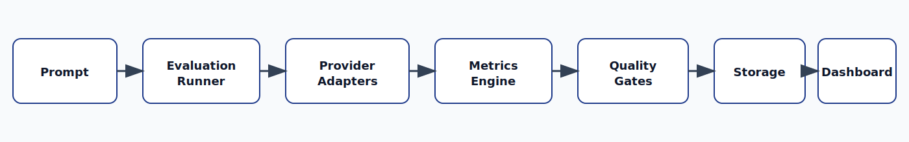
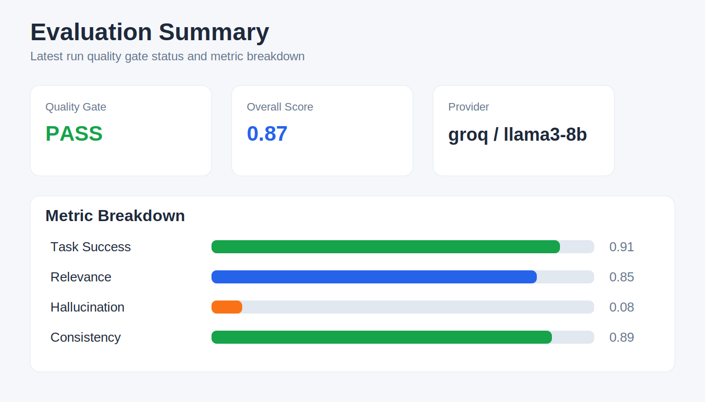
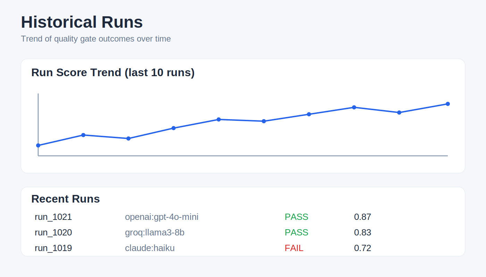
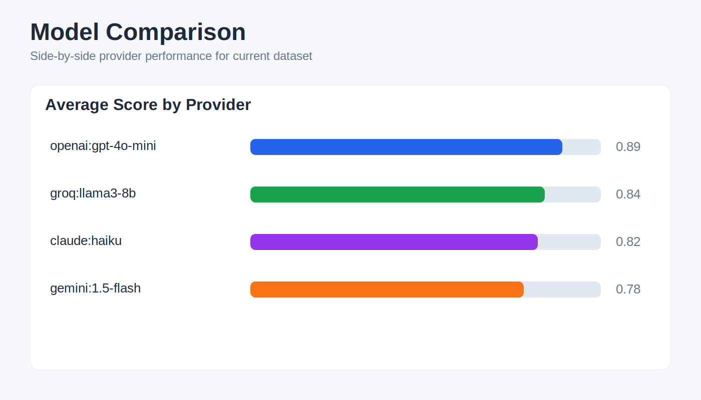

# LLMQ - LLM Quality Gate

[](https://github.com/Emart29/llm-quality-gate/actions/workflows/llm-quality-gate.yml)

**LLMQ is a provider-agnostic, CI-first LLM evaluation framework that prevents prompt and model regressions before deployment.**

## What is LLMQ?

LLMQ is a **developer tool** and **CI quality gate** that automatically tests, measures, and enforces quality standards across any LLM provider. It's an **evaluation framework** with an optional **dashboard** (not a SaaS) designed to integrate seamlessly into your development workflow.

- **Dev Tool**: Test prompts and models locally during development
- **CI Quality Gate**: Automatically block deployments that fail quality thresholds
- **Evaluation Framework**: Comprehensive metrics and provider comparison
- **Optional Dashboard**: Web UI for visualization and historical tracking

## Target Audience

- **LLM Application Developers** building production systems
- **DevOps Engineers** implementing quality gates in CI/CD pipelines
- **ML Engineers** benchmarking and comparing LLM providers
- **QA Teams** establishing automated testing for LLM-powered features

## Core Value Proposition

✅ **Prevent Regressions**: Catch prompt and model degradations before they reach production  
✅ **Provider Agnostic**: Test across 8 LLM providers with unified metrics  
✅ **CI-First Design**: Built for automated quality enforcement in GitHub Actions  
✅ **Zero Lock-in**: Self-hosted with DuckDB storage and optional dashboard  

## Features

### LLM Providers (8 Supported)
- **Free/Open**: Groq, HuggingFace, OpenRouter
- **Proprietary**: OpenAI, Anthropic Claude, Google Gemini  
- **Local**: Ollama, LocalAI

### Evaluation Metrics (4 Core)
- **Task Success**: Exact match + semantic similarity
- **Relevance**: Embedding-based cosine similarity
- **Hallucination**: LLM-as-Judge + heuristic fallback
- **Consistency**: Pairwise similarity across multiple runs

### Quality Gates & CI/CD
- Configurable thresholds with automatic pass/fail enforcement
- GitHub Actions integration with PR comments
- Regression detection against baseline metrics
- Canary evaluation workflow (subset → full promotion)

### Storage & Analytics
- DuckDB persistence with historical tracking
- Provider benchmarking and trend analysis
- Web dashboard with Chart.js visualizations
- FastAPI backend with comprehensive REST API

## Architecture



Flow: **Prompt → Evaluation Runner → Provider Adapters → Metrics Engine → Quality Gates → Storage → Dashboard**

## Dashboard Preview

### Evaluation summary view



### Historical runs



### Model comparison



## Quick Start

### Installation

```bash
# Clone the repository
git clone https://github.com/Emart29/llm-quality-gate.git
cd llm-quality-gate

# Install dependencies
pip install -r requirements.txt

# Configure API keys
cp .env.example .env
# Edit .env with your API keys (see Environment Configuration below)
```

### Environment Configuration

LLMQ requires API keys for the LLM providers you want to use. The `.env.example` file contains comprehensive documentation for all supported providers.

**Quick Setup:**
```bash
# 1. Copy the example file
cp .env.example .env

# 2. Edit .env and add your API keys
# At minimum, add one provider key (e.g., GROQ_API_KEY for free usage)

# 3. Test your configuration
python -m integrations.cli.main providers
```

**Supported Providers:**
- **Free/Open**: Groq (recommended for getting started), HuggingFace, OpenRouter
- **Proprietary**: OpenAI, Anthropic Claude, Google Gemini
- **Local**: Ollama, LocalAI (no API keys needed)

**Provider Recommendations:**
- **Getting Started**: Use Groq (free, fast, good models)
- **Production**: OpenAI GPT-3.5/4 or Anthropic Claude
- **Privacy/Cost**: Ollama with local models
- **Experimentation**: HuggingFace for open model access

### Run Your First Evaluation

```bash
# Start the dashboard + API server
python -m integrations.cli.main dashboard

# In another terminal, run an evaluation
python -m integrations.cli.main eval --provider groq

# View results at http://localhost:8000
```

## CI Integration Example

Add to your `.github/workflows/quality-gate.yml`:

```yaml
name: LLM Quality Gate

on:
  pull_request:
    paths: ['prompts/**', 'llm/**', 'config.yaml']

jobs:
  quality-gate:
    runs-on: ubuntu-latest
    steps:
      - uses: actions/checkout@v4
      - uses: actions/setup-python@v5
        with:
          python-version: '3.11'
      
      - name: Install dependencies
        run: pip install -r requirements.txt
      
      - name: Run LLM Quality Gate
        env:
          GROQ_API_KEY: ${{ secrets.GROQ_API_KEY }}
          OPENAI_API_KEY: ${{ secrets.OPENAI_API_KEY }}
        run: |
          python -m ci.runner --provider groq --fail-on-regression
      
      - name: Comment PR with results
        if: always()
        uses: actions/github-script@v7
        # ... (see .github/workflows/llm-quality-gate.yml for full example)
```

## Usage Examples

### CLI Usage

```bash
# Evaluate single provider
python -m integrations.cli.main eval --provider groq

# Compare multiple providers
python -m integrations.cli.main compare --providers groq,openai,claude

# List available providers
python -m integrations.cli.main providers

# Run canary evaluation (25% of tests, auto-promote if passing)
python -m integrations.cli.main eval --provider openai --canary
```

### API Usage

```bash
# Start evaluation
curl -X POST http://localhost:8000/api/v1/evaluate \
  -H "Content-Type: application/json" \
  -d '{"provider": "groq", "model": "llama3-8b-8192"}'

# Get historical runs
curl http://localhost:8000/api/v1/runs

# Compare providers
curl http://localhost:8000/api/v1/compare?providers=groq,openai

# Set baseline for regression detection
curl -X POST http://localhost:8000/api/v1/runs/{run_id}/baseline
```

### Python Integration

```python
from evals.service import EvaluationService

service = EvaluationService()

# Run evaluation
result = await service.evaluate_provider(
    provider="groq",
    model="llama3-8b-8192"
)

# Check quality gate
if result["quality_gate"]["passed"]:
    print("✅ Quality gate passed!")
else:
    print("❌ Quality gate failed!")
    print(f"Failed metrics: {result['quality_gate']['failed_metrics']}")
```

## CI Optimization

LLMQ automatically detects CI environments and optimizes performance for fast, reliable testing.

### Automatic CI Detection

When the `CI` environment variable is set to `true`, `1`, or `yes`, LLMQ automatically switches to lightweight mode:

```bash
# CI environments (GitHub Actions, GitLab CI, etc.)
export CI=true
python -m pytest tests/  # Uses mock embeddings, runs in <60s
```

### CI Mode Optimizations

**Embedding Model**: Replaces SentenceTransformer downloads with a fast, deterministic mock model
- ✅ No network calls or model downloads
- ✅ Deterministic results for consistent testing
- ✅ ~50x faster than real embeddings
- ✅ Maintains all test functionality

**Semantic Similarity**: Uses lightweight mock embeddings that provide:
- Text length and vocabulary features
- Deterministic similarity scores
- Full compatibility with all metrics (Task Success, Relevance, Hallucination, Consistency)

### Local vs CI Behavior

| Environment | Embedding Model | Network Calls | Test Speed |
|-------------|----------------|---------------|------------|
| **Local** (`CI` not set) | Real SentenceTransformer | Downloads models from HuggingFace | ~2-5 minutes |
| **CI** (`CI=true`) | Mock embedding model | None | <60 seconds |

### Verification

```bash
# Test in CI mode
export CI=true
python -m pytest tests/ -v  # Fast, no downloads

# Test in local mode  
unset CI
python -m pytest tests/ -v  # Full embeddings, slower
```

The optimization is completely transparent - all tests pass in both modes with identical functionality.

## Configuration

```yaml
llm:
  default_provider: "groq"
  temperature: 0.0

providers:
  groq:
    api_key_env: "GROQ_API_KEY"
    model: "llama3-8b-8192"
  openai:
    api_key_env: "OPENAI_API_KEY"
    model: "gpt-3.5-turbo"

roles:
  generator:
    provider: "groq"      # Fast, free for generation
  judge:
    provider: "openai"    # Reliable for evaluation

quality_gates:
  task_success_threshold: 0.8
  relevance_threshold: 0.7
  hallucination_threshold: 0.1
  consistency_threshold: 0.8
```

## Roadmap

### v1.1 (Next Release)
- [ ] Slack/Discord webhook integrations
- [ ] Custom metric plugins
- [ ] A/B testing framework
- [ ] Performance benchmarking metrics

### v1.2 (Future)
- [ ] Multi-language dataset support
- [ ] Advanced regression analysis
- [ ] Cost tracking per provider
- [ ] Distributed evaluation workers

### v2.0 (Long-term)
- [ ] Visual prompt debugging
- [ ] Automated prompt optimization
- [ ] Enterprise SSO integration
- [ ] Advanced analytics dashboard

## Contributing

We welcome contributions! Please see [CONTRIBUTING.md](CONTRIBUTING.md) for guidelines.

### Development Setup

```bash
# Clone and setup
git clone https://github.com/Emart29/llm-quality-gate.git
cd llm-quality-gate
python -m venv venv
source venv/bin/activate  # or venv\Scripts\activate on Windows
pip install -r requirements.txt

# Run tests
python -m pytest tests/ -v

# Start development server
python -m integrations.cli.main dashboard --reload
```

### Project Structure

```
llm-quality-gate/
├── llm/                    # LLM provider abstractions
├── evals/                  # Evaluation framework & metrics
├── storage/                # DuckDB persistence layer
├── dashboard/              # FastAPI backend + web UI
├── ci/                     # CI/CD integration scripts
├── integrations/           # CLI and external integrations
├── tests/                  # Test suite
└── .github/workflows/      # GitHub Actions
```

## License

MIT License - see [LICENSE](LICENSE) for details.

---

**Questions?** Open an issue or start a discussion. We're here to help you implement quality gates for your LLM applications.
